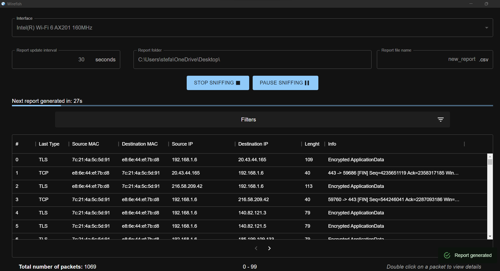
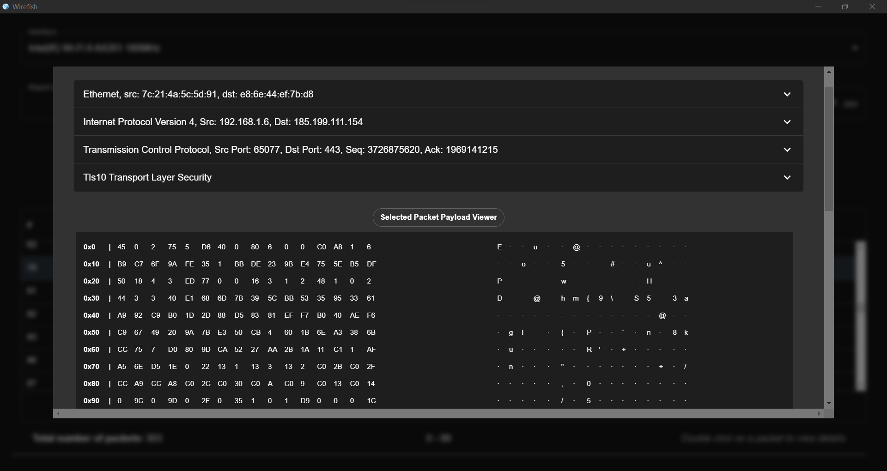

# Wirefish
<div align="center">


[](https://github.com/stefanodevenuto/poc-sniffer/tree/main)
[](https://opencollective.com/tauri)


    
A _blazingly fast_ multiplatform packet sniffer built with Tauri!

---
<br>

<br><br>



</div>

## Installation
1. Properly install all the needed [dependencies](#dependencies)
2. Download the latest [release](https://github.com/stefanodevenuto/poc-sniffer/releases) of the intended OS and follow the installation wizard

If you prefer building from source code, you must install all the Tauri's dependencies, clone the repo and run `npm run tauri build`

## Features
+ **Interception**: sets the network adapter in promiscuous mode and reconstructs all the info related to the collected packets. For now, the list of fully parsed packets is:
    - Ethernet
    - IPv4, IPv6
    - ICMPv4, ICMPv6
    - UDP, TCP
    - HTTP, DNS, TLS

    The interception can be paused, in order to be subsequently resumed, or stopped.

    

+ **Filtering**: the collected packets can be filtered out by means of _packet type_ (eg. IPv4, TCP, ...) or _packet inner fields_ (eg. Source IP, Destination MAC, ...)


+ **Report generation**: a textual representation describing a synthesis of the observed events is provided. For each of the network address/port pairs that have been observed, it lists the protocols that was transported, the cumulated number of bytes transmitted, the timestamp of the first and last occurrence of information exchange, all in CSV format. For instance:
    ```csv
    Source IP,Destination IP,Source Port,Destination Port,First Data Exchange,Last Data Exchange,Bytes Exchanged,Protocols
    192.168.158.49,185.199.111.154,53826,443,2022-10-19 16:54:13,2022-10-19 16:54:14,12837,TCP;IPv4;TLS
    192.168.158.49,216.58.209.42,53798,443,2022-10-19 16:54:10,2022-10-19 16:54:10,120,IPv4;TCP
    192.168.158.49,192.168.158.100,-,-,2022-10-19 16:54:17,2022-10-19 16:54:17,42,ARP
    192.168.158.49,34.158.0.131,61392,443,2022-10-19 16:54:19,2022-10-19 16:54:19,184,IPv4;TLS;TCP
    ```
+ **Report interval**: the report is generated every a user-provided interval expires, and continues to do so until the sniffing process is paused/stopped.

## Dependencies
### Windows
WinPcap is needed, along with the WinPcap Developer's Pack. Add the `/Lib` or `/Lib/x64` folder to your `LIB` environment variable.

### Linux
On Debian based Linux, install `libpcap-dev`. If not running as root, you need to set capabilities like so: `sudo setcap cap_net_raw,cap_net_admin=eip path/to/bin`

### Mac OS X
`libpcap` should be installed on Mac OS X by default.
